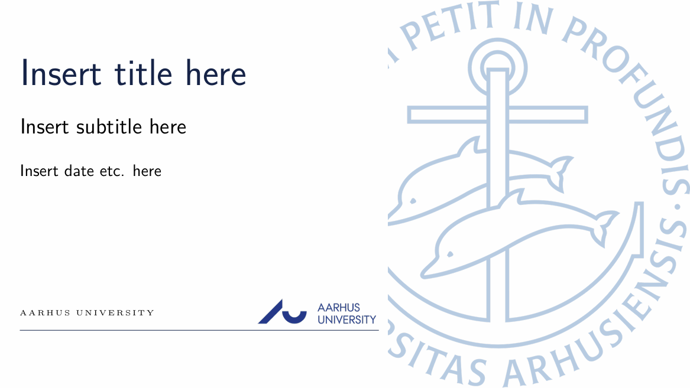
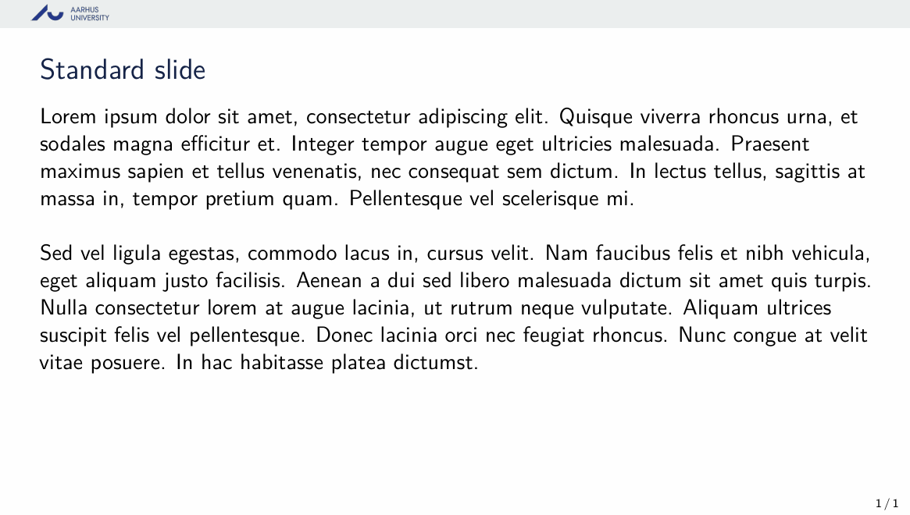

# Aarhus University LaTeX Presentation Template

This is an unofficial template for academic presentations related to Aarhus University. This template follows the Aarhus University branding guidelines, but is not an official template and is created for student use. 
It is a LaTeX template for a beamer of size 16:9. The template consists of an AU-folder with imagefiles, a AUstyle.sty file and a main.tex file.

# Compiler 
In order for the document to compile, one needs to use XeLaTeX or LuaLaTeX as compiler. This can be done in Overleaf by Menu -> Settings -> Compiler -> Choose XeLaTeX/LuaLaTeX.

# Theme
## Title page example


## Standard page example



# Slide format
The template consist of a front page and a standard slide. A new slide can be added by using the frame-environment. It's important that [hoved] is included after \begin{frame}.

If one wishes to print the beamer st. it expands to A4 size, one can add the following code before \begin{document}

```
\usepackage{pgfpages}
\pgfpagesuselayout{resize to}[a4paper,landscape,border shrink=5mm]
```

# Acknowledgements
This template is based on the [KU-theme](https://www.overleaf.com/latex/templates/beamer-small-16-9-ucph/mrqwbxndjbhz) template and adapted to match the Aarhus University theme. 